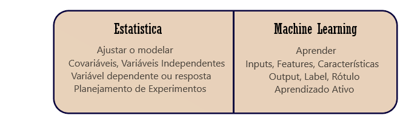

```{r setup, include=FALSE}
knitr::opts_chunk$set(message=FALSE,warning=FALSE, cache=TRUE)
```
[EM CONSTRUÇÃO]

&nbsp;

&nbsp;

# Introdução

Redes sociais, compras online, câmera e microfone de smartphones e notebooks. Estes são alguns exemplos de  fontes que alimentam enormes bancos de dados diariamente sem percebermos. Mas afinal, como trabalhar com esse montante de dados e extrair deles informações úteis? Com o aprendizado de máquina, um dos braços da inteligência artificial, podemos analisar esses dados de maneira automática e otimizada.   
Nesta apostila, você encontrará métodos de aprendizado estatístico de máquina do tipo supervisionado, isto  é, técnicas onde o computador aprende sozinho uma função para modelar e entender os dados, levando em consideração suposições e regras estatísticas.  

&nbsp;

# Um pouco de história

  O nome “Machine Learning” foi criado por um funcionário da IBM, Arthur Lee Samuelem 1959. Mas os primórdios desse ramo, <div style="float:right;max-width: 30%; max-height: 30%;" markdown="1">  </div> começaram em 1943 com o nascimento da inteligência artificial, quando o neuro anatomista Warren McCulloch e o matemático Walter Pitts estudaram como os neurônios funcionam e criaram um modelo usando um circuito eletrônico com base neste funcionamento. Ao fim de 1970 já existiam muitas técnicas matemáticas e estatísticas para o aprendizado a partir dos dados, entretanto apenas em meados dos anos 80 foi computacionalmente possível implementar uma dessas técnicas na prática, os primeiros a realizarem essa prática Breiman, Friedman, Olshen e Stone, que conseguiram implementar os métodos de árvore de classificação, regressão, validação cruzada e seleção de modelo.  
  Com os recursos computacionais disponíveis hoje, a aprendizagem estatística de máquina pode ser aplicada nas mais diversas áreas e já é usada por empresas de diversos ramos como marketing, biologia, controle e automação, educação, finanças, medicina e até linguística.

&nbsp;
 
# O que temos de novo?

Com o avanço das técnicas de estatistica e da computação, hoje temos duas diferentes formas de ver a modelagem: a primeira e mais forte entre os estatísticos, tem como foco a inferência, regressão e interpretação de parâmetros, assumindo que o modelo está correto e checando as suposições necessárias; a segunda e mais presenta a àrea de aprendizagem de máquina, tem como foco o poder de predição do modelo, sendo esse modelo o mais correto ou não. Você perceberá ao longo do seu aprendizado e prática na área de estatistica e aprendizado de máquina, que muitas vezes essas visões se combinam a fim de encontrar a melhor solução para o problema em questão.

&nbsp;

# Aprendizado Supervisionado


Aprendizado estatístico de máquina supervisionado nada mais é que um método para analisar dados e construir modelos, tal que o computador consegue aprender sozinho a identificar padrões, relações entre as variáveis e fazer previsões. Tudo isso utilizando apenas os dados disponibilizados a ele, os quais seguem uma determinada regra ou tem um determinado "rótulo".
<div style="float:center;max-width: 95%; max-height: 95%;" markdown="1">  </div> 
Ao coletar as informações de interesse, podemos encontrar dois tipos de dado:

 - **Quantitativos:** Informações que podem ser medidas por valores numéricos, sejam eles contínuos ou discretos. Como por exemplo a altura, peso, comprimento quantidade de peças etc.
 
 - **Qualitativos:** Informações que podem ser separados por categorias, sejam elas ordinais ou nominais. Por exemplo sexo, grau de instrução, níveis de concentração de um medicamento etc.

Tais dados podem ser analisados por duas técnicas no ambito da aprendizagem de máquina supervisionada: a  regressão, aplicada a dados quantitativos e a classificação, aplicada a dados do tipo qualitativos.

Além disso algumas terminologias naturais da estatística são diferentes no mundo da aprendizagem de máquina supervisionado:

<div style="float:center;max-width: 75%; max-height: 75%;" markdown="1">  </div> 

Vale lembrar também as formas das notações utilizadas nesta apostila

(forma vetor/singular 15/03)
(explicar dados de treino e dados de teste)

&nbsp;

# Regressão 

<div style="float:right;max-width: 40%; max-height: 40%;" markdown="1">  </div> 

&nbsp;

Neste tópico, como citado acima, trabalharesmos com as variáveis do tipo quantitativas. O modelo que relaciona um vetor de inputs $X^T=(X_1,X_2,...,X_p)$ e os outputs $\hat{Y}$ é:

$$\hat{Y} =\hat\beta_0+\sum_{j=1}^{p}X_j\hat\beta_j$$

onde $\beta_0$ é chamado de tendência. Deste modo temos uma função linear p-dimensional, de espaço de entrada $f(X)=X^T\beta$, com coeficiente angular $f^{'}(X)=\beta$. 

&nbsp;

Na forma matricial temos que o mesmo modelo pode ser escrito como

$\qquad\qquad\qquad\qquad\qquad\qquad\hat{Y}=X^T\beta$


$\hat{Y}=\begin{bmatrix} \hat{y}_{11} \\ \hat{y}_{21} \\ \vdots  \\ \hat{y}_{n1} \\ \end{bmatrix}$  $X=\begin{bmatrix} 1 & x_{11} & x_{12} & x_{13} & \dots  & x_{1p} \\
    1 &x_{21} & x_{22} & x_{23} & \dots  & x_{2p} \\ \vdots & \vdots & \vdots & \vdots & \ddots & \vdots \\ 1 & x_{n1} & x_{n2} & x_{n3} & \dots  & x_{np} \end{bmatrix}$  $\beta=\begin{bmatrix} \beta_1 \\  \beta_2 \\ \vdots  \\ \beta_n  \\ \end{bmatrix}$

(adicionar explicação geometrica com desenhos)

&nbsp;

# Método de Mínimos Quadrados (MSQ)

Considerando as formas matriciais, formalmente temos que o método dos mínimos quadrados, o qual utiliza os coeficietes $\beta$ para minimizar a soma dos quadrados dos erros:

<div style="float:right;max-width: 30%; max-height: 30%;" markdown="1">  </div>

$$RSS(\beta) = \sum_{i=1}^{N}(y_i - x_i^T \beta)^2$$
$$RSS(\beta) = (y-X\beta)^T(y-X\beta)$$

onde:

 * $X = X_{(N_xp)}$ é uma matriz com vetores de input.
 * $y = y_{(N_x1)}$ é um vetor de saída dos dados de treino

&nbsp;

Devirando o RSS (no formato acima) em relação à $\beta$ teremos

$$X^T(y-X\beta)=0$$
Se $X^TX$ é não singular, então há solução única, a qual é: $\hat{\beta}=(X^TX)^{-1}X^Ty$

&nbsp;

Portando o valor ajustado $\hat{y_i}$ correspondente à entrada $x_i$ será 

$$\hat{y_i}(x_i)=x_i^T\hat{\beta}$$

 

# Classificação
  
  * Regressão Logistica
  * Discriminantes Lineares (LDA)


## Método dos vizinhos mais próximos (KNN)

Este método consiste em utilizar as $K$ observações dos dados de treino mais próximas de $x$, para estimar o valor de $y$.

$$\hat{Y}(x) = \frac{1}{K}\sum_{x_i\in N_k(x)}y_i$$
onde:

 * $N_{k(x)}$ são os pontos mais próximos do ponto $x_i$ a amostra de treino;
 * A proximidade destes pontos é baseada na distância euclidiana.

Ou seja, encontramos os K pontos espaço de entrada $x_i$ mais próximos de $x$ e fazemos as médias dessas respostas.


# Função de perda

Ao realizar uma predição, teremos os erros incluidos nela e é do nosso interesse penalizar estes erros para conseguirmos quantificar o "custo" destes erros. A função de perna mais comum e conveniente é a *Perda de erro quadrático*:


$$L(Y,f(X))=(Y-f(X))^2$$
E para utilizar esta função, precisaremos de um critério para a escolha da função interna $F(X)$. Para  conseguir chegar a essa escolha, usaremos a esperança do erro de predição (expected prediction error):

$$ EPE(f(x)) = E(Y-f(X))^2$$
$$\qquad\quad = \int [y-f(x)]^2 P_r(d_x,d_y)$$
$$\qquad\quad = E_x E_{y|x}([Y-f(x)]^2|X)$$
Deste modo, para encontrar $f(x)$ é suficiente minimizar a função $EPE(f(x))$ em um ponto:

$$f(x)=argmin_c E_{Y|X}((Y-c)^2|X=x)$$
$$f(x)= E(Y|X=x)$$

A função $f(x)$ acima, é chamda também de *função de regressão*, já que a melhor predição para Y é a média condicional dada pelo erro quadrático médio (isso para qualquer ponto de X=x). Já o *método KNN* calcula $f(x)$ fazendo a média de todos os $y_i$ com entrada $x_i=x$:

$$\hat{f}(x) = Média (y_i|x_i \in N_k(x))$$

&nbsp;

## Métodos de reamostragem
 
 * Validação Cruzada
 * Boostrap

&nbsp;


# Referência

 * Introdução & Um pouco de História

Disponível em: [https://www.doc.ic.ac.uk/~jce317/history-machine-learning.html](https://www.doc.ic.ac.uk/~jce317/history-machine-learning.html)

Disponível em: [https://sitn.hms.harvard.edu/flash/2017/history-artificial-intelligence/](https://sitn.hms.harvard.edu/flash/2017/history-artificial-intelligence/)

Disponível em: [http://infolab.stanford.edu/pub/voy/museum/samuel.html](http://infolab.stanford.edu/pub/voy/museum/samuel.html)

Disponível em: [https://artsandculture.google.com/asset/arthur-samuel-demonstrates-how-machine-learning-can-be-used-to-play-checkers-in-1962-ibm-watson-media/vgH46mpas8dL4g](https://artsandculture.google.com/asset/arthur-samuel-demonstrates-how-machine-learning-can-be-used-to-play-checkers-in-1962-ibm-watson-media/vgH46mpas8dL4g)  

&nbsp;

 * O que temos de novo?  

Hastie, Tibshirani, and Friedman. The Elements of Statistical Learning: Data Mining, Inference, and Prediction. Springer, 2009 2nd edition. Disponível em:<https://web.stanford.edu/~hastie/ElemStatLearn/>.  

James, Witten, Hastie, and Tibshirani. An Introduction to Statistical Learning, with applications in R. Springer, 2013. Disponível em: <http://www-bcf.usc.edu/~gareth/ISL/>.  

&nbsp;

 * Aprendizado de Máquina VS Aprendizado Estatístico de Máquina  

&nbsp;

 * Regressão  

&nbsp;

 * Classificação  
