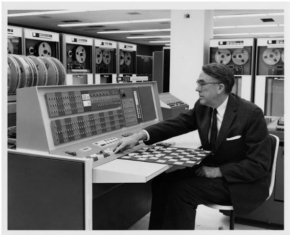

```{r setup, include=FALSE}
knitr::opts_chunk$set(message=FALSE,warning=FALSE, cache=TRUE)
```

&nbsp;

&nbsp;

# Introdução

  Redes sociais, compras online, câmera e microfone de smartphones e notebooks. Estes são alguns exemplos de fontes que alimentam enormes bancos de dados diariamente sem percebermos. Mas afinal, como trabalhar com esse montante de dados e extrair deles informações úteis? Com o aprendizado de máquina, um dos braços da inteligência artificial, podemos analisar esses dados de maneira automática e otimizada.   
Aprendizado de máquina nada mais é que um método para analisar dados e construir modelos, tal que o computador consegue aprender sozinho a identificar padrões, fazer previsões e tomar decisões. Tudo isso utilizando apenas os dados disponibilizados a ele e seus próprios erros cometidos no processo.  
Nesta apostila, você encontrará métodos de aprendizado estatístico de máquina, isto é, técnicas onde o computador aprende sozinho a modelar e entender os dados, levando em consideração as suposições e regras estatísticas.  

&nbsp;

# Um pouco de história

  O nome “Machine Learning” foi criado por um funcionário da IBM, Arthur Lee Samuelem 1959. Mas os primórdios desse ramo, <div style="float:right;max-width: 30%; max-height: 30%;" markdown="1">  </div> começaram em 1943 com o nascimento da inteligência artificial, quando o neuro anatomista Warren McCulloch e o matemático Walter Pitts estudaram como os neurônios funcionam e criaram um modelo usando um circuito eletrônico com base neste funcionamento. Ao fim de 1970 já existiam muitas técnicas matemáticas e estatísticas para o aprendizado a partir dos dados, entretanto apenas em meados dos anos 80 foi computacionalmente possível implementar uma dessas técnicas na prática, os primeiros a realizarem essa prática Breiman, Friedman, Olshen e Stone, que conseguiram implementar os métodos de árvore de classificação, regressão, validação cruzada e seleção de modelo.  
  Com os recursos computacionais disponíveis hoje, a aprendizagem estatística de máquina pode ser aplicada nas mais diversas áreas e já é usada por empresas de diversos ramos como marketing, biologia, controle e automação, educação, finanças, medicina e até linguística.
 

# My first post

2018 | 7 | 23 Last compiled: `r Sys.Date()`

Notice that whatever you define as a top level header, automatically gets put into the table of contents bar on the left. 


# Referência

Disponível em: [https://www.doc.ic.ac.uk/~jce317/history-machine-learning.html](https://www.doc.ic.ac.uk/~jce317/history-machine-learning.html)

Disponível em: [https://sitn.hms.harvard.edu/flash/2017/history-artificial-intelligence/](https://sitn.hms.harvard.edu/flash/2017/history-artificial-intelligence/)

Disponível em: [http://infolab.stanford.edu/pub/voy/museum/samuel.html](http://infolab.stanford.edu/pub/voy/museum/samuel.html)

Disponível em: [https://artsandculture.google.com/asset/arthur-samuel-demonstrates-how-machine-learning-can-be-used-to-play-checkers-in-1962-ibm-watson-media/vgH46mpas8dL4g](https://artsandculture.google.com/asset/arthur-samuel-demonstrates-how-machine-learning-can-be-used-to-play-checkers-in-1962-ibm-watson-media/vgH46mpas8dL4g)


