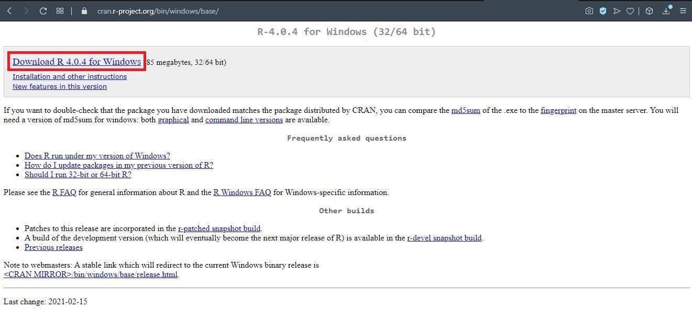
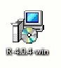
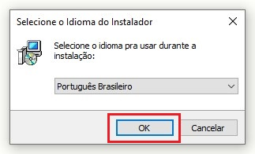
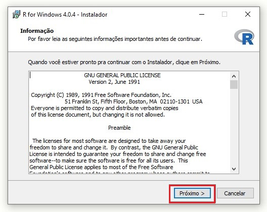
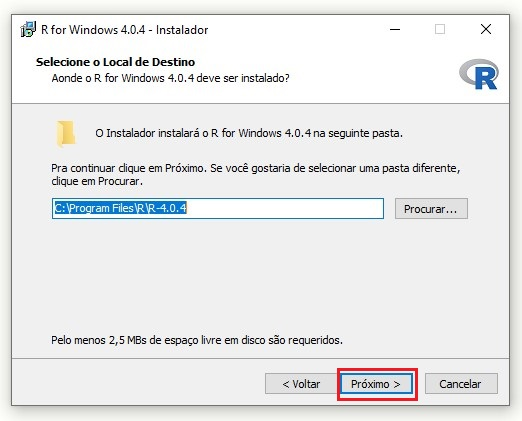
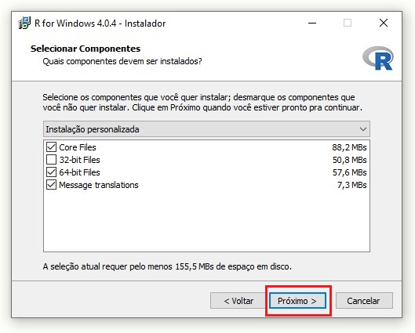
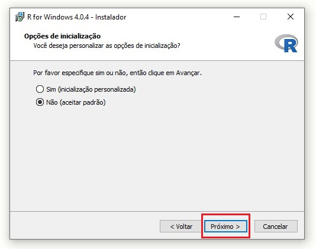
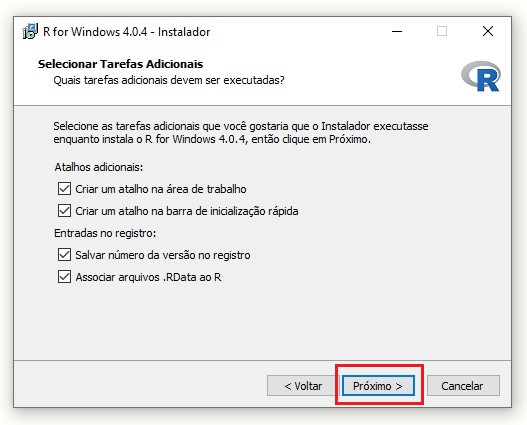
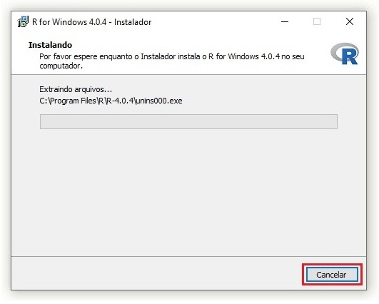
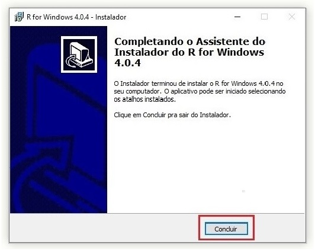

```{r setup, include=FALSE}
knitr::opts_chunk$set(message=FALSE,warning=FALSE, cache=TRUE)
```

&nbsp;

&nbsp;

Texto introdutorio

# Como baixar e instalar o programa R e RStudio

&nbsp;

* *Windows*

  + Baixar e instalar o R

1. Acesse [https://cran.r-project.org/bin/windows/base/](https://cran.r-project.org/bin/windows/base/) e clique em “Download R 4.0.4 for Windows”.

<div style="float:center;max-width: 80%; max-height: 95%;" markdown="1">  
</div> 

2. Localize o arquivo baixado em sua máquina e dê um duplo clique no ícone para iniciar a instalação. 
	
<div style="float:center;max-width: 30%; max-height: 30%;" markdown="1">  
</div> 

3. Clique em “Executar”.

<div style="float:center;max-width: 50%; max-height: 50%;" markdown="1">  
</div> 

4. Mantenha a opção de idioma clicando em “OK”.

<div style="float:center;max-width: 50%; max-height: 50%;" markdown="1">  </div> 

5. Clique em “Próximo” nas duas janelas seguintes.

<div style="float:center;max-width: 50%; max-height: 50%;" markdown="1">  </div> 

<div style="float:center;max-width: 50%; max-height: 50%;" markdown="1">  </div> 

6. Verifique qual é o tipo do seu sistema (32 ou 64 bits) e deixe selecionada apenas o tipo correto. Clique em “Próximo”.

<div style="float:center;max-width: 50%; max-height: 50%;" markdown="1">  </div> 

7.	Mantenha as opções selecionadas  e clique em “Próximo” nas duas janelas seguintes.

<div style="float:center;max-width: 50%; max-height: 50%;" markdown="1">  </div> 

<div style="float:center;max-width: 50%; max-height: 50%;" markdown="1">  </div> 

8. Aguarde a instalação.

<div style="float:center;max-width: 50%; max-height: 50%;" markdown="1">  </div> 

9.  Por fim, clique em “Concluir”.  

<div style="float:center;max-width: 50%; max-height: 45%;" markdown="1">  </div> 

&nbsp;

&nbsp;  

  + Baixar a instalar o RSudio  

1. Acesse [https://www.rstudio.com/products/rstudio/download/#download](https://www.rstudio.com/products/rstudio/download/#download), desça até a parte do site que segue na imagem abaixo. Clique em "DOWNLOAD RSTUDIO FOR WINDOWS"

<div style="float:center;max-width: 100%; max-height: 100%;" markdown="1">  
</div> 

2. Localize o arquivo baixado em sua máquina e dê um duplo clique no ícone para iniciar a instalação. 

<div style="float:center;max-width: 30%; max-height: 30%;" markdown="1">  
</div> 

3. Clique em “Próximo” nas duas janelas seguintes.  

<div style="float:center;max-width: 50%; max-height: 50%;" markdown="1">  
</div> 

4. Clique em "Instalar" e aguarde. Caso a segunda janela não feche sozinha, clique em "Próximo"

<div style="float:center;max-width: 50%; max-height: 50%;;" markdown="1">  
</div> 

5. Por fim, clique em "Concluir"

<div style="float:center;max-width: 50%; max-height: 50%;" markdown="1">  
</div> 

6. Ao abrir o R-studio, você verá a seguinte tela com as seguintes partições:  

<div style="float:center;max-width: 100%; max-height: 100%;" markdown="1">  
</div>  

A primeira partição é o “Script”, onde digitaremos os códigos que serão salvos; na segunda temos o “Console”, onde são exibidas as mensagens de erro, alerta, resultados de códigos, entre outros, nele também podemos digitar e rodar os códigos, mas estes não serão salvos; no terceiro quadro temos como uma opção o  “Enviroment”, que mostra onde os objetos do código são armazenados; no quarto e último quadro temos as opções “File”, “Plots”, “Help” e ”Viewer”, o Help é uma ferramenta que pode nos ajudar muito.  Para mais detalhes acesse https://rstudio.com/resources/cheatsheets/  e procure por “RStudio IDE Cheatsheet”.


&nbsp;

&nbsp;

* *Linux*

&nbsp;

&nbsp;
* *MacOS*

## Primeiros passos

You can add more headers by adding more hashtags. These won't be put into the table of contents


# Referência
https://www.allisonhorst.com/
https://livro.curso-r.com/refer%C3%AAncias.html#programa%C3%A7%C3%A3o-em-r
Peng, R.D. R Programming for Data Science. Leanpub, 2015. Chambers, J. Software for Data Analysis: Programming with R (Statistics and Computing). Springer, 2009.
