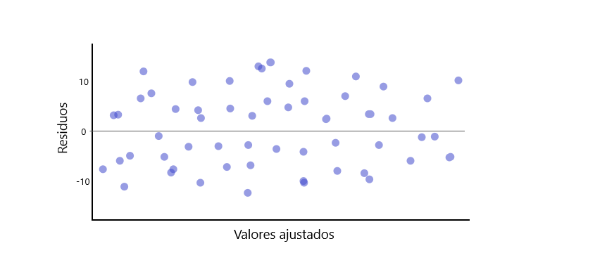
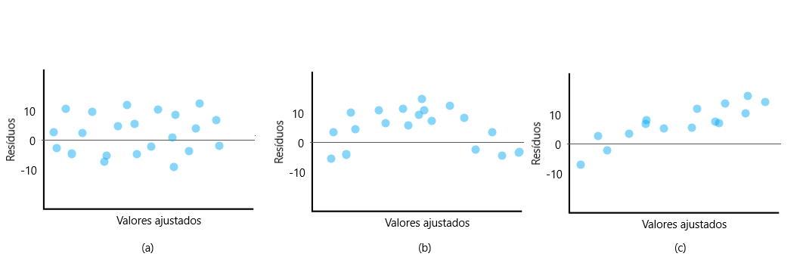
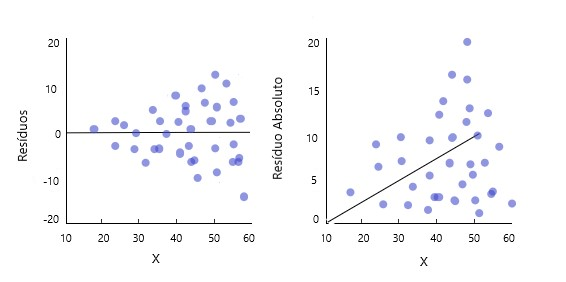
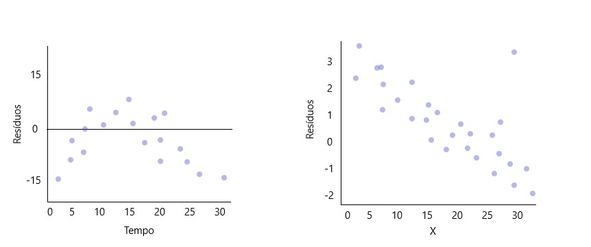
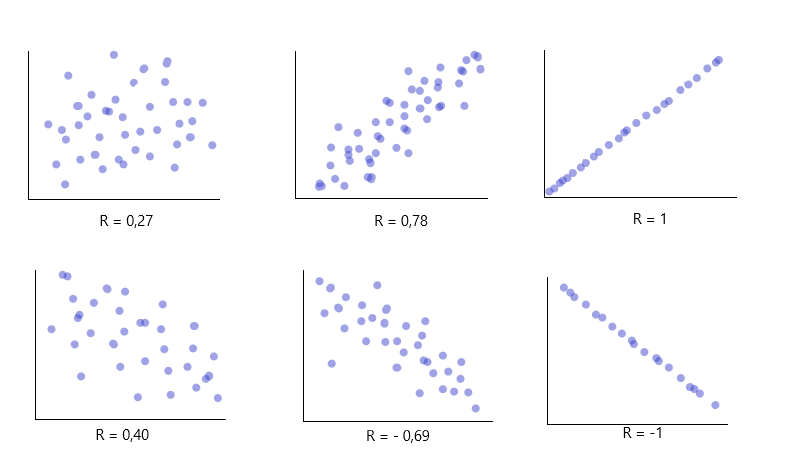

```{r setup, include=FALSE}
knitr::opts_chunk$set(message=FALSE,warning=FALSE, cache=TRUE)
```
[EM CONSTRUÇÃO]

&nbsp;

&nbsp;

# Análise de Regressão

&nbsp;

Os métodos de análise de regressão formam um conjunto de poderosas ferramentas estatisticas, que estudam a relação entre duas ou mais variaveis. Por ser de facil interpretação, essas ferramentas podem se aplicar nas mais diversas àreas e situações, como por exemplo: faixa salarial e nível de educação, consumo de açúcar e percentual de gordura, quantidade de fertilizante e crescimento da planta, quantidade gasta em publicidade e quantidade de vendas de um produto, consumo de contéudo na TV e faixa etária, etc. Esse conjunto de ferramentas nos permite lidar com os três tópicos mais comuns quando se trata de regressão:

* **Modelagem:** Cria uma equação que descreve a relação entre as variáveis em questão,de forma parcimoniosa;
* **Covariância:** Estuda a variação entre as variâveis que aparentemente não tem relação entre si;
* **Predição:** Estima os resultados do modelo para situações incertas.

O termo regressão foi criado por Francis Galton no século 19 durante seu estudo sobre a relação entre a altura de pais e filhos, desenvolvido no artigo [*Regression Toward Mediocrity in Hereditary Stature*](https://galton.org/essays/1880-1889/galton-1886-jaigi-regression-stature.pdf). Hoje aplicamos estas tecnicas com o apoio da programação, aqui faremos uso do software RStudio.  

&nbsp;

# 1. Regressão Linear Simples  

Nesta sessão estudaremos as técnicas de regresão aplicadas à duas variaveis que relacionam de forma linear, isto é, essa relação pode ser descrita por uma reta.

Vamos dar uma olhada nos [dados](https://people.sc.fsu.edu/~jburkardt/datasets/regression/x09.txt) idade e teor de gordura no sangue que seguem abaixo:

```{r, echo=FALSE}
library("readr")
library("ggplot2")
```

```{r, echo=FALSE}
dados = read_table2("https://people.sc.fsu.edu/~jburkardt/datasets/regression/x09.txt", col_names = FALSE ,skip = 36) #lendo apenas a tabela de dados 

dados = dados[,c(4,5)]#seleciona as duas ultimas colunas

colnames(dados) = c("Idade", "Gordura") #renomendo as colunas

head(dados) #leitura das seis primeiras linhas da tabela "dados"
```

Como pode-se notar no gráfico, a relação entre idade e teor de gordura no sangue aparentemente linear.
```{r, include=FALSE}
fit <- lm(Gordura ~ Idade, dados) 
fit
predicted <- data.frame(pred = predict(fit, dados), Idade = dados$Idade)
```


```{r, echo=FALSE}
ggplot(data = dados, aes(x = Idade, y = Gordura)) + 
  geom_point(color='cornflowerblue') +
  geom_line(color='cornflowerblue',data = predicted, aes(x=Idade, y=pred))+
  theme_bw()
```

Sabemos que na matemática básica, a relação linear é descrita como:

$$Y_i = a+bX_i$$
onde:  
 - $Y$ são as $i$ variáveis dependentes;  
 - $a$ é o intercepto;  
 - $b$ é o coeficiente angular;
 - $X$ são as $i$ variáveis independetes;  
 - $i=1,2,3...$.
 
No caso do exemplo, a relação entre Idade e Teor de Gordura no Sangue pode ser descrita por:

$$\hat{y}_i = 102.6 + 5.3x_i$$
&nbsp;

# 1.1 Modelo
 
Em regressão linear, a estrutura é quase a mesma. Mudamos o nome dos parâmetros $a$ e $b$ para as letras gregas $\beta_0$ e $\beta_1$ respectivamente e adicionamos o termo $\varepsilon_i$, que vai representar o erro (também chamado de ruído) de cada observação (já que, quando coletamos determinado medida em um experimento, essa medição é passivel de pequenos erros a cada coleta). Então, o **modelo de regressão linear simples** é:onde:  
 
 - $Y$ são as $i$ variáveis independentes (ou resposta para a i-ésima obervação);  
 - $\beta_0$ é o intercepto;  
 - $\beta_1$ é o incremento de $X_i$ em $Y_i$;
 - $X$ são as $i$ variáveis independetes (ou conhecidas); 
 - $\varepsilon_i$ são os erros aleatórios associados a cada observação $X_i$;
 - $i=1,2,3...$.


$$Y_i =\beta_0+\beta_1X_i + \varepsilon_i$$

 
Quando aplicamos este modelo aos nosso dados, teremos os **valores ajustados** ou **estimados**, i.e.:

$$\hat{Y_i}= \hat{\beta_0}+\hat{\beta_1}X_i$$
Nestes valores ajustados estão contidos os **resíduos**, que são a diferença entre o valor verdadeiro da variável resposta e o valor estimado pelo modelo, respectivamente:

$$\epsilon_i=Y_i-\hat{Y_i}$$
$$\qquad\qquad\quad=Y_i-\hat{\beta_0}+\hat{\beta_1}X_i$$

Vale lembrar que **erro** e **resíduo** não são a mesma coisa:

* O erro aleatório $\varepsilon_i$ do modelo se refere ao contexto populacional, antes do ajuste do modelo e amostragem.
* O resíduo $\epsilon_i$ se refere ao contexto amostral, após o modelo ser ajustado com base na amostra coletada.

A primeira suposição a respeito deste modelo a respeito dos erros:

* O valor esperado dos erros é sempre zero: $E[\varepsilon_i]=0 \quad\forall i$;   
* Sua variância é sempre constante $Var[\varepsilon_i]=\sigma^2\quad\forall i$;  
* Eles não são correlacionados: $Cov(\varepsilon_i, \varepsilon_j)=0 \quad \forall\quad i \ne j$.
* Eles seguem a distribuição de probabilidade normal e são independentes e identicamente distribuidos: $\varepsilon \stackrel{iid}{\sim} N(0, \sigma^2)$

<div style="float:centre; max-width:100%; max-height: 80%;" markdown="1"> 
</div> 

Voltando ao exemplo, na figura abaixo temos as representações dos parâmetros nas partes em destaque: $\beta_0$ como intercepto, isto é, ponto em que a reta corta o eixo $Y$; $\beta_1$ como incremento em $Y$ para cada uma unidade de $X$; e por fim $\varepsilon_i$ como a distância entre a reta de regressão e a observação $X_i$.

<div style="float:center;max-width:90%; max-height: 120%;" markdown="1"> 
</div> 
 
Deste modo, nosso modelo de regressão linear simples que descreve a relação entre idade e teor de gordura no sangue é:

$$\hat{y}_i = 102.6 + 5.3x_i+\varepsilon_i$$
para $i=1,2,...,24,25$.

&nbsp;

# 1.2 Propriedades do modelo

Agora que conhecemos o modelo, vamos conferir algumas de suas propriedades. Sabemos então qe $Y_i$ são as variáveis resposta e que $\varepsilon_i$ são variáveis aleatórias correspondentes aos erros. Como o valor esperado de $\varepsilon_i$ é sempre zero, então:

<div style="float:right;max-width:50%; max-height: 70%;" markdown="1"> 
</div>

$$E[Y_i]=E[\beta_0+\beta_1X_i+\varepsilon_i]$$
$$\qquad\quad=E[\beta_0+\beta_1X_i]+E[\varepsilon_i]$$
$$\qquad\quad=E[\beta_0+\beta_1X_i]+0\quad$$
$$\qquad=\beta_0+\beta_1X_i\quad\qquad$$
 
&nbsp;

$\qquad\qquad Var[Y_i]=Var[\beta_0+\beta_1X_i+\varepsilon_i]$  

$\qquad\qquad\qquad\quad = Var[\varepsilon_i]\qquad\qquad$  

$\qquad\qquad\qquad\quad = \sigma^2\qquad\qquad$  

Além disso, como os erros $\varepsilon_i$ e $\varepsilon_j$ não correlacionados, então as respostas $Y_i$ e $Y_j$ também não serão.

# 1.2 Estimação dos parâmetros 
 
&nbsp;
 
Mas afinal, como determinamos os valores de $\beta_0$ e $\beta_1$? Para resolver essa questão, temos dois métodos estatisticos:  método de mínimos quadrados e método da máxima verossimilhança. Em ambos o objetivo é sempre encontrar um $\beta_0$ e $\beta_1$ que nos dê a melhor reta em relação aos dados.
 
&nbsp;

# 1.2.1 Método de Mínimos Quadrados (MMQ)
 
&nbsp;

  Para encontrar a melhor reta, este método minimiza a soma dos erros $\varepsilon_i$, ou seja, a soma das distâncias entre a reta e os dados coletados. Como estamos somando o tamanho desse erros, elevamos seus valores ao quadrado, então temos: 
    
$$\varepsilon_1^2+\varepsilon_2^2+\varepsilon_3^2+...+\varepsilon_n^2 = \sum_{i=1}^{n} \varepsilon_i^2$$
    
para $i= 1,2,3,...n.$, i.e. para n observações.
   Como $\varepsilon_i = Y_i-(\beta_0+\beta_1X_i)= Y_i-\beta_0-\beta_1X_i$, então queremos encontrar um $\beta_0$ e $\beta_1$ tal que minimize $Q$:
   
$$Q=\sum_{i=1}^{n} \varepsilon_i^2=\sum_{i=1}^{n} (Y_i-\beta_0-\beta_1X_i)^2$$
  Para encontrar essas estimativas analiticamente nos baseando no modelo de regressão simples, usaremos as duas equações que seguem abaixo,conjuntamente:

$$\sum_{i=1}^{n}Y_i = n\beta_0-\beta_1\sum_{i=1}^{n}X_i$$
$$\sum_{i=1}^{n}X_iY_i = \beta_0\sum_{i=1}^{n}X_i-\beta_1\sum_{i=1}^{n}X_i^2$$
  Essa equações, também chamadas de equações normais, podem ser derivadas em relação aos parâmetros:

$$\frac{\partial Q}{\partial \beta_0}=-2\sum_{i=1}^{n}(Y_i-\beta_0-\beta_1X_i)$$   
$$\frac{\partial Q}{\partial \beta_1}=-2\sum_{i=1}^{n}X_i(Y_i-\beta_0-\beta_1X_i)$$        


   Igualando essas derivadas à zero, encontramos os valores de $\beta_0$ e $\beta_1$ que minimizam $Q$:
 
&nbsp;

<div style="float:right;max-width:35%; max-height: 35%;" markdown="1"> 
</div> 

$$-2\sum_{i=1}^{n}(Y_i-\hat{\beta}_0-\hat{\beta}_1X_i)=0$$
$$-2\sum_{i=1}^{n}X_i(Y_i-\hat{\beta}_0-\hat{\beta}_1X_i)=0$$

Dividindo os dois lados das equações por $-2$:
$$\sum_{i=1}^{n}(Y_i-\hat{\beta}_0-\hat{\beta}_1X_i)=0$$
$$\sum_{i=1}^{n}X_i(Y_i-\hat{\beta}_0-\hat{\beta}_1X_i)=0$$

Expandindo as equações, conseguimos chegar nas equações normais:
$$\sum_{i=1}^{n}Y_i-n\hat{\beta}_0-\hat{\beta}_1\sum_{i=1}^{n}X_i=0$$
$$\sum_{i=1}^{n}X_iY_i-\hat{\beta}_0\sum_{i=1}^{n}X_i-\hat{\beta}_1\sum_{i=1}^{n}X_i^2=0$$

&nbsp;


<div class="panel panel-success">
$\qquad\qquad\qquad\qquad\qquad\qquad\qquad\qquad\qquad$ **Equações Normais**

<div class="panel-body">

$$\sum_{i=1}^{n}Y_i\quad=n\hat{\beta}_0+\hat{\beta}_1\sum_{i=1}^{n}X_i$$
$$\sum_{i=1}^{n}X_iY_i\quad=\hat{\beta}_0\sum_{i=1}^{n}X_i+\hat{\beta}_1\sum_{i=1}^{n}X_i^2$$

</div>
</div>

&nbsp;


A partir delas conseguim ao isolar os parâmetros e obter as estimações. Para mais detalhes desta etapa, veja a [Apêndice: Demonstração 1](https://larissars.github.io/Apostilas-estatistica/apendice.html#Demonstração_1).

&nbsp;

$$\hat{\beta}_0=\bar{Y}-\beta_1\bar{X}$$

$$\hat{\beta}_1 = \frac{\sum_{i=1}^{n}(X_i-\bar{X})(Y_i-\bar{Y})}{\sum_{i=1}^{n}(X_i-\bar{X})}$$

As **vantagens** do método dos mínimos quadrados é que, além de ser comumente usado, ele é comportado pelos programas de estatística de modo geral.    
Entretanto, precisamos de certos **requisitos** para poder usar ele:


- **Lineariedade dos dados:** seu comportamento pode ser decrito por uma reta

<div style="float:center;max-width:90%; max-height: 90%;" markdown="1"> 
</div>

- **Normalidade dos resíduos:** os resíduos do modelo seguem uma distribuição aproximadamente normal, i.e., $\epsilon \cong N(\mu, \sigma^2)$.

<div style="float:center;max-width:45%; max-height: 45%;" markdown="1"> 
</div>

- **Homocedasticidade:** a variabilidade dos resíduos é constante., ou seja, $Var(\epsilon)=c$.

<div style="float:center;max-width:40%; max-height: 40%;" markdown="1"> 
</div>

- **Erros sem autocorrelação:** Os valores ordenados não tem relação com o espaço ou tempo. Matematicamente,  $\epsilon_i$ e $\epsilon_j$ tem  $Cov(\epsilon_i, \epsilon_j)=0, \forall i \ne j$.

<div style="float:center;max-width:50%; max-height: 50%;" markdown="1"> 
</div>

# 1.2.1.1 Propriedades dos estimadores de MMQ   

Os estimadores $\hat{\beta}$ obtidos pelo método de método de mínimos quadrados são funções lineares de Y ([Apêndice: Demonstação 2](https://larissars.github.io/Apostilas-estatistica/apendice.html#Demonstração_2)). E segundo o Teorema de Gauss Markov, dado as condições do modelo de regressão linear, o método de mínimos quadrados:

* Tem estimadores $\beta_0$ e $\beta_1$ não viesados, i.e., o valor esperado do estimador é ao próprio arametro que foi estimado: $E[\hat{\beta_0}]= \beta_0$ e $E[\hat{\beta_1}]= \beta_1$. Isso acontece independente da distribuição de probabilidade desses erros ([Apêndice: Demonstação 3](https://larissars.github.io/Apostilas-estatistica/apendice.html#Demonstração_3)).

* Tem variância mínima entre todos os estimadores não viesados e lineares.  

$$Var[\hat{\beta_0}]=\sigma^2\Bigg[\frac{1}{n}+\frac{\bar{X}^2}{\sum_{i=0}^{n}(X_i-\bar{X}^2)}\Bigg]$$  

$$Var[\hat{\beta_1}]=\frac{\sigma^2}{\sum_{i=0}^{n}(X_i-\bar{X})^2}$$

Logo eles são os mais precisos entre esse tipo de estimador.  

* Os estimadores de mínimos quadrados tem distribuição de probabilidade Normal. 
  
$$\hat{\beta_0} \sim N\Bigg(\beta_0, \sigma^2\Bigg[\frac{1}{n}+\frac{\bar{X}^2}{\sum_{i=0}^{n}(X_i-\bar{X}^2)}\Bigg]\Bigg)$$  
 
$$\hat{\beta_0} \sim N\Bigg(\beta_1,\frac{\sigma^2}{\sum_{i=0}^{n}(X_i-\bar{X}^2)} \Bigg)$$  


Além disso, temos que:

* Considerando $\sum_{i=1}^{n}(X_i-\bar{X})(Y_i-\bar{Y})=S_{xy}$ como a soma dos produtos de X e Y, $\sum_{i=1}^{n}(X_i-\bar{X})=S_{XX}$ como a soma dos quadrados de X, podemos afirmar que:

$$\hat{\beta}_1 = \frac{\sum_{i=1}^{n}(X_i-\bar{X})(Y_i-\bar{Y})}{\sum_{i=1}^{n}(X_i-\bar{X})}=\frac{S_{xy}}{S_{xx}}$$  

* Esses estimadores são funções lineares das observações das variáveis resposta $y_i$.

* Suas variâncias são proporcionais as variâncias dos erros

* São estimadores correlacionados


Veja mais detalhes sobre os resultados acima em [Demonstração X]().  

# 1.2.1.3 Exemplo no R

Para reproduzir o exemplo exibido no inicio do capítulo, precisaremos carregar os pacotes *readr* e *ggplot2*.

```{r}
#carregando os pacotes necessários
library("readr")
library("ggplot2")
```

Em seguidas vamos ler os dados obtidos na [página](https://people.sc.fsu.edu/~jburkardt/datasets/regression/x09.txt).

```{r, message=FALSE, warning=FALSE}

dados = read_table2("https://people.sc.fsu.edu/~jburkardt/datasets/regression/x09.txt", col_names = FALSE ,skip = 36) #lendo apenas a tabela de dados 

dados = dados[,c(4,5)]#seleciona as duas ultimas colunas

colnames(dados) = c("Idade", "Gordura") #renomendo as colunas

head(dados) #Mostra as 6 primeiras linhas da tabela
```

Com os dados já separados, ajustaremos um modelo de regressão linear simples.

```{r, message=FALSE, warning=FALSE}
ajuste <- lm(Gordura ~ Idade, dados) #ajuste do modelo
summary(ajuste) #exibe os resultados detalhados do ajuste
```
Dado dos coeficientes do ajuste, ambos significativos, temos o modelo

$$\hat{y}_i = 102.6 + 5.3x_i$$

E partir dele, podemos fazer o gráfico da reta dos valores preditos sobre os valores observados.

```{r, echo=FALSE}
predicted <- data.frame(pred = predict(fit, dados), Idade = dados$Idade) #Calculo dos falores preditos pelo modelo

ggplot(data = dados, aes(x = Idade, y = Gordura)) + 
  geom_point(color='cornflowerblue') +
  geom_line(color='cornflowerblue',data = predicted, aes(x=Idade, y=pred))+
  theme_bw()  #gráfico dos valores preditos sobre os valores observados
```

&nbsp;

# 1.2.2 Método da Máxima Verossimilhança (MMV)

<div style="float:right;max-width:50%; max-height: 50%;" markdown="1"> </div>
 O método de máxima verossilimilhança utiliza o produtos das densidades das distribuição de probabilidade de $Y_i$ como uma medida para a consistência dos parâmetros para aquela amostra. Assim o método escolhe os valores máximos da verossimilhança estimada, tal que os valores dos paramêtros sejam mais consistentes. 
 
 Aqui, por ser mais simples, usaremos a log-verossimilhança negartiva. Partindo do fato que $E(Y_i) = \beta_0-\beta_1X_i$ e $Var[Y_i]=\sigma^2$, então a função densidade de probabilidade de $Y_i$ será:
 
$$f_i=\frac{1}{\sqrt {2\pi\sigma} }exp\bigg[-\frac{1}{2}\bigg(\frac{Y_i-\beta_0-\beta_1X_i}{\sigma}\bigg)^2 \bigg]$$
  
Fazendo o produtório das n densidades, correspondentes a cada uma das n observações, temos a função de máxima verossimilhança. Nela consideramos que a variância dos erros de cada observação é desconhecida:

$$\mathcal{L}(\beta_o, \beta_1, \sigma^2)=	\prod_{i=1}^{n} \frac{1}{(2\pi\sigma^2)^{1/2}}exp\bigg[-\frac{1}{2\sigma^2}(Y_i-\beta_0-\beta_1X_i)^2 \bigg]$$
Simplificando a equação temos:
$$\mathcal{L}(\beta_o, \beta_1, \sigma^2)=\frac{1}{(2\pi\sigma^2)^{n/2}}exp\bigg[ -\frac{1}{2\sigma^2}\sum_{i=1}^{n}(Y_i-\beta_0-\beta_1X_i)^2\bigg]$$
<div style="float:right;max-width:35%; max-height: 35%;" markdown="1"> 
</div>

Para encontrar as estimativas dos parâmetros precisaremos fazer as derivadas parciais de $L(\beta_o, \beta_1, \sigma^2)$ em relação a cada parâmetro. Como $L(\beta_o, \beta_1, \sigma^2)$ e $ln(\mathcal{L}(\beta_o, \beta_1, \sigma^2))$ são equações que maximizam a verossimilhança, podemos trabalhar com ambos. Note que usaremos a seguinte notação:

$$L(\beta_o, \beta_1, \sigma^2) = -\frac{n}{2} ln( 2\pi) -\frac{n}{2} ln(\sigma^2)-\frac{1}{2\sigma^2}\sum_{i=1}^{n}(y_i-\beta_0-\beta_1x_i)^2$$  

Mas escolhemos o logaritmo da função de máxima verossimilhança por ser mais facil de derivar. Seguem as derivadas particias dos parâmetros, já igualadas a zero:

&nbsp;

$$\frac{\partial L(\beta_o, \beta_1, \sigma^2)}{\partial \beta_0}\quad= -\frac{1}{\sigma^2}\sum_{i=1}^{n}(y_i-\beta_0-\beta_1x_i)=0$$

$$\quad\quad=\sum_{i=1}^{n}(y_i-\beta_0-\beta_1x_i)=0$$
$$\sum_{i=1}^{n}y_i=n\beta_0+(\sum_{i=1}^{n}x_i)\beta_1$$
$$\hat{\beta}_0=\bar{Y}-\beta_1\bar{X}$$  

&nbsp;

$$\frac{\partial L(\beta_o, \beta_1, \sigma^2)}{\partial \beta_1} \quad= -\frac{1}{\sigma^2}\sum_{i=1}^{n}(y_i-\beta_0-\beta_1x_i)=0$$
$$\quad\quad\quad\quad\quad\quad=\sum_{i=1}^{n}(y_i-\beta_0-\beta_1x_i)x_i=0$$
$$\sum_{i=1}^{n}y_ix_i=(\sum_{i=1}^{n}x_i)\beta_0+(\sum_{i=1}^{n}x_i^2)\beta_1  $$

$$\hat{\beta}_1 = \frac{\sum_{i=1}^{n}(X_i-\bar{X})(Y_i-\bar{Y})}{\sum_{i=1}^{n}(X_i-\bar{X})}$$ 

&nbsp;

$$\frac{\partial L(\beta_o, \beta_1, \sigma^2)}{\partial \sigma^2}=\frac{n}{\hat{\sigma}^2}-\frac{1}{\hat{\sigma}^4}\sum_{i=1}^{n}(Y_i-\beta_0-\beta_1X_i)=0$$

$$\frac{n}{\hat{\sigma}^2}=\frac{1}{\hat{\sigma}^4}\sum_{i=1}^{n}(Y_i-\beta_0-\beta_1X_i)$$
$$n=\frac{1}{\hat{\sigma}^2}\sum_{i=1}^{n}(Y_i-\beta_0-\beta_1X_i)$$

$$\hat{\sigma}^2=\frac{1}{n}\sum_{i=1}^{n}(Y_i-\beta_0-\beta_1X_i)^2$$
Como $\hat{Y}_i=\beta_0-\beta_1X_i$, então:

$$\hat{\sigma}^2=\frac{\sum_{i=1}^{n}(Y_i-\hat{Y}_i)^2}{n}$$

# 1.2.2.1 Propriedades dos estimadores de (MMV)

Esse estimador é do tipo um estimador viesado para p parâmetro da variância $E[\hat{\sigma^2}]=\frac{n-1}{n}\sigma^2$. Mas medida que n cresce, $\hat{\sigma^2}$ tende a ser não viesado:

$$lim_{n \to \infty }E[\hat{\sigma^2}]=lim_{n \to \infty} \frac{n-1}{n}\sigma^2=\sigma^2$$

Contudo ele é muito confiavel devido algumas propriedades:

* Consistência;
* Eficiência Assintótica;
* Normalidade Assimptótica;
* Invariância.

# 1.3 Análise de Resíduos

Como já citado anteriormente, os resíduos são a diferença entre o valor verdadeiro da variável resposta e o valor estimado pelo modelo, respectivamente:

$$\epsilon_i=Y_i-\hat{Y_i}$$
Eles são usados para avaliar o quão bom é o ajuste do modelo, já que, toda variabilidade não explicada pelo modelo, vai para os resíduos. Para isso vamos verificar seis caracteristicas:

 * Se a regressão ajustada é uma função linear;
 * Se os erros tem variância constante;
 * Se os erros são independentes;
 * Se os erros tem distribuição normal;
 * Se o modelo não se ajusta para alguns outliers;
 * Se uma ou mais variaveis preditoras podem ser retiradas do modelo.
 
Um dos gráficos mais usados para avaliar se a função é linear e foi bem ajustada é o gráfico de pontos dos resíduos pelos valores ajustados:

<div style="float:center;max-width:90%; max-height: 90%;" markdown="1"> 
</div> 

Em um ajuste satisfatório teremos pontos aleatórios em torno da reta horizontal (que marca o resíduo igual a zero) e que variam de forma constante, como na figura (a). Quando isso não acontece (como nas demais imagens), temos resíduos viesados, os quais podem nos dar pistas sobre o comportamento não captado pelo modelo ajustado. Por exemplo, na figura (b) temos uma comportamento claramento quadrático e na figura (c) uma tendência linear positiva, essas caracteristicas não devem aparecer nos resíduos e sim no modelo ajustado. Se você se deparar com essa situação, refaça seu modelo.

<div style="float:center;max-width:100%; max-height: 100%;" markdown="1"> 
</div> 

Além disso é importante lembrar que, quando o valor de um i-ésimo resíduo $\epsilon_i$ for:

 * Positivo, significa que o modelo subestimou a observação
 
$$\epsilon_i>0 \quad \to \quad Y_i-\hat{Y_i}>0 \quad \to \quad Y_i>\hat{Y_i}$$  

 * Negativo, significa que o modelo superestimou a observação
 
$$\epsilon_i<0 \quad \to \quad Y_i-\hat{Y_i}<0 \quad \to \quad Y_i<\hat{Y_i}$$
Outro gráfico importante é o dos resíduos absolutos (ou residuos ao quadrado) versus a variável X (preditora) ou os valores ajustados de Y (i.e. $\hat Y$). Este gráfico é util para checarmos a variância dos resíduos é ou não constante, bem como a presença de outliers.

<div style="float:center;max-width:90%; max-height: 90%;" markdown="1"> 
</div> 

Já a independência dos erros pode ser avaliada pelo simples gráfico de pontos dos resíduos em relação a variável preditora ou em relação ao tempo, pois com eles conseguimos ver se há a relação de um i-ésimo resíduo com os demais próximos a ele.

<div style="float:center;max-width:90%; max-height: 90%;" markdown="1"> 
</div>

Por fim e não menos importante, devemos checar a normalidade dos resíduos. Isso pode ser feito por diversos gráficos: gráfico da distribuição (Box plot, histograma, gráfico de pontos ou gráfico de ramos e folhas); gráfico de comparação de frequências; gráfico de normalidade dos resíduos (o mais usado).

# 1.3.1 Correlação

As relações entre as variáveis ajustadas no modelo podem ser fortes ou fracas e avaliar essa força é muito importante para a avaliação do modelo. Uma forma de quantificar essa força é pelo **correlação**, denotada pela letra R. Suponha que temos um conjunto de dados $(x_1,y_1),(x_2,y_2),...,(x_n,y_n)$, sua correlação é dada por:

$$R = \frac{1}{n-1}\sum_{i=1}^{n} \frac{x_i-\bar{x}}{s_x} \frac{y_i-\bar{y}}{s_y}$$
onde $\bar{x}$, $\bar{y}$, ${s_x}$ e ${s_y}$ são respectivamente as médias e desvio padrão amostral das variáveis x e y.

Os valores de R serão sempre entre -1 e 1. Quanto mais próximo de 1, mais forte é a correlação linear positiva entre as variáveis. E quanto mais próximo de -1, maior é a correlação linear negativa entre as mesmas. Abaixo temos a imagem que representa as duas situações: em (a) temos três casos de correlação linear positiva e em (b) temos os casos para correlação linear negativa.

<div style="float:center;max-width:90%; max-height: 90%;" markdown="1"> 
</div>

# 1.3.1 Coeficiente de Determinação

R² ajustado

# Análise de Variância

Applied regresion pag 52,65-68
Applied Linear Statistical Models 5th pag 87-97

  a)pq fazer
  b)exemplos
  c)como fazer
  

Applied Linear Statistical Models 5th pag 98

Applied regresion pag 55/64-65

### Intervalos de confiança

Applied Linear Statistical Models 5th pag 68,73-78

Applied regression pag 58,59

      a)  exemplos de uso
      b) como fazer

### Teste de Hipótese
      a)  exemplos de uso
      b) como fazer

### Predição
      a)  exemplos de uso
      b) como fazer

### Diagnostico
 a)pq fazer
 b)como fazer
### Transformações
 a)pq fazer
  b)exemplos
  c)como fazer
  

&nbsp;


------
+999999999
## Regressão Linear Multipla
 
### Forma matricial
### Estimação dos parâmetros
### Análise de Variância
### Predição
### Teste de Hipótese
### Intervalo de Confiança

Soma extra de quadrados(?)  
Coef de determinação parcial (?)  
Reg multi padronizada (?)  
Multicolineariedade(?)  
Medidas de influência e Alavancagem (?) *Caio  

&nbsp;

## Regressão Polinomial
 
Regressão com intervenção (?)  
Região de confiança (?)  
Teste de Hip Linear (?)  

&nbsp;

## Seleção de modelos

Regressão Parcial (?)   
Inflação da variância (?)   

&nbsp;

## Regressão Não-Linear

Regressão logistica(?) *openintro

# Referência  

&nbsp;

* Análise de Regressão  

**Azevedo, Caio L. N.**. ME 613A - Análise de regressão, Primeiro Semestre 2019. IMECC - UNICAMP. Disponível em: [https://www.ime.unicamp.br/~cnaber/Material_ME613_1S_2019.htm](https://www.ime.unicamp.br/~cnaber/Material_ME613_1S_2019.htm). Acessado em: Julho à X de 2021  

**Carvalho, B**. ME613: Análise de Regressão. Github. 2021. Disponível em: [http://me613-unicamp.github.io/](http://me613-unicamp.github.io/). Acessado em: Julho à X de 2021  

**Caffo, B**. (2019). Regression models for data science in R. Leanpub. 2019. Disponível em: [https://leanpub.com/regmods/read](https://leanpub.com/regmods/read). Acessado em: Julho à X de 2021  

**Diez, D.; Rundel, M. C.; Barr, C. D.**. Openintro Statistics. Quarta edição. Atualizado em 12 de Novembro de 2019. Versão online gratuita. Disponível em: [https://www.openintro.org/book/os/](https://www.openintro.org/book/os/). Acessado em: Julho à X de 2021  

**Kutner, M. H.; Nachtsheim, C. J.;Neter, J.; Li, W.**.Applied Linear Statistical Models. Quinta edição. 2005.

João L. F. Batista. Análise de Regressão Aplicada.2004. Departamento de Ciências Florestais
ESALQ - USP

http://www.leg.ufpr.br/~paulojus/embrapa/Rembrapa/Rembrapase19.html