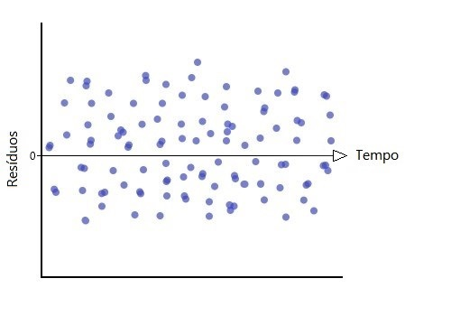

```{r setup, include=FALSE}
knitr::opts_chunk$set(message=FALSE,warning=FALSE, cache=TRUE)
```
[EM CONSTRUÇÃO]

&nbsp;

&nbsp;

# **Análise de Regressão**

&nbsp;

Os métodos de análise de regressão formam um conjunto de poderosas ferramentas estatisticas, que estudam a relação entre duas ou mais variaveis. Por ser de facil interpretação, essas ferramentas podem se aplicar nas mais diversas àreas e situações, como por exemplo: faixa salarial e nível de educação, consumo de açúcar e percentual de gordura, quantidade de fertilizante e crescimento da planta, quantidade gasta em publicidade e quantidade de vendas de um produto, consumo de contéudo na TV e faixa etária, etc. Esse conjunto de ferramentas nos permite lidar com os três tópicos mais comuns quando se trata de regressão:

* **Modelagem:** Cria uma equação que descreve a relação entre as variáveis em questão,de forma parcimoniosa;
* **Covariância:** Estuda a variação entre as variâveis que aparentemente não tem relação entre si;
* **Predição:** Estima os resultados do modelo para situações incertas.

O termo regressão foi criado por Francis Galton no século 19 durante seu estudo sobre a relação entre a altura de pais e filhos, desenvolvido no artigo [*Regression Toward Mediocrity in Hereditary Stature*](https://galton.org/essays/1880-1889/galton-1886-jaigi-regression-stature.pdf). Hoje aplicamos estas tecnicas com o apoio da programação, aqui faremos uso do software RStudio.  

&nbsp;

# 1. Regressão Linear Simples  

Nesta sessão estudaremos as técnicas de regresão aplicadas à duas variaveis que relacionam de forma linear, isto é, essa relação pode ser descrita por uma reta.

Vamos dar uma olhada nos [dados](https://people.sc.fsu.edu/~jburkardt/datasets/regression/x09.txt) idade e teor de gordura no sangue que seguem abaixo:

```{r, echo=FALSE}
library("readxl")
library("ggplot2")
dados = read_xlsx("C:\\Users\\Larissa Ribeiro\\Documents\\GitHub\\TesteWebsite\\sangue.xlsx")
dados  = dados[order(dados$Idade),c(3,4)]
```

```{r, echo=FALSE}
head(dados)
```

Como pode-se notar no gráfico, a relação entre idade e teor de gordura no sangue aparentemente linear.
```{r, include=FALSE}
fit <- lm(Gordura ~ Idade, dados) 
fit
predicted <- data.frame(pred = predict(fit, dados), Idade = dados$Idade)
```


```{r, echo=FALSE}
# this is the predicted line of multiple linear regression
ggplot(data = dados, aes(x = Idade, y = Gordura)) + 
  geom_point(color='cornflowerblue') +
  geom_line(color='cornflowerblue',data = predicted, aes(x=Idade, y=pred))+
  theme_bw()
```

Sabemos que na matemática básica, a relação linear é descrita como:

$$Y_i = a+bX_i$$
onde:  
 - $Y$ são as $i$ variáveis dependentes;  
 - $a$ é o intercepto;  
 - $b$ é o coeficiente angular;
 - $X$ são as $i$ variáveis independetes;  
 - $i=1,2,3...$.
 
No caso do exemplo, a relação entre Idade e Teor de Gordura no Sangue pode ser descrita por:

$$\hat{y}_i = 102.6 + 5.3x_i$$
&nbsp;

# 1.1 Modelo
 
Em regressão linear, a estrutura é quase a mesma. Mudamos o nome dos parâmetros $a$ e $b$ para as letras gregas $\beta_0$ e $\beta_1$ respectivamente e adicionamos o termo $\varepsilon_i$, que vai representar o erro (também chamado de ruído) de cada observação (já que, quando coletamos determinado medida em um experimento, essa medição é passivel de pequenos erros a cada coleta). Então, o **modelo de regressão linear simples** é:


$$Y_i =\beta_0+\beta_1X_i + \varepsilon_i$$
onde:  
 
 - $Y$ são as $i$ variáveis independentes (ou resposta para a i-ésima obervação);  
 - $\beta_0$ é o intercepto;  
 - $\beta_1$ é o incremento de $X_i$ em $Y_i$;
 - $X$ são as $i$ variáveis independetes (ou conhecidas); 
 - $\varepsilon_i$ são os erros de cada observação $X_i$;
 - $i=1,2,3...$.

Voltando ao exemplo, na figura abaixo temos as representações dos parâmetros nas partes em destaque: $\beta_0$ como intercepto, isto é, ponto em que a reta corta o eixo $Y$; $\beta_1$ como incremento em $Y$ para cada uma unidade de $X$; e por fim $\varepsilon_i$ como a distância entre a reta de regressão e a observação $X_i$.

<div style="float:center;max-width:90%; max-height: 120%;" markdown="1"> 
</div> 
 
Deste modo, nosso modelo de regressão linear simples que descreve a relação entre idade e teor de gordura no sangue é:

$$\hat{y}_i = 102.6 + 5.3x_i+\varepsilon_i$$
para $i=1,2,...,24,25$.

&nbsp;

# 1.2 Estimação dos parâmetros 
 
&nbsp;
 
Mas afinal, como determinamos os valores de $\beta_0$ e $\beta_1$? Para resolver essa questão, temos dois métodos estatisticos:  método de mínimos quadrados e método da máxima verossimilhança. Em ambos o objetivo é sempre encontrar um $\beta_0$ e $\beta_1$ que nos dê a melhor reta em relação aos dados.
 
&nbsp;

# 1.2.1 Método de Mínimos Quadrados
 
&nbsp;

  Para encontrar a melhor reta, este método minimiza a soma dos erros $\varepsilon_i$, ou seja, a soma das distâncias entre a reta e os dados coletados. Como estamos somando o tamanho desse erros, elevamos seus valores ao quadrado, então temos: 
    
$$\varepsilon_1^2+\varepsilon_2^2+\varepsilon_3^2+...+\varepsilon_n^2 = \sum_{i=1}^{n} \varepsilon_i^2$$
    
para $i= 1,2,3,...n.$, i.e. para n observações.
   Como $\varepsilon_i = Y_i-(\beta_0+\beta_1X_i)= Y_i-\beta_0-\beta_1X_i$, então queremos encontrar um $\beta_0$ e $\beta_1$ tal que minimize $Q$:
   
$$Q=\sum_{i=1}^{n} \varepsilon_i^2=\sum_{i=1}^{n} (Y_i-\beta_0-\beta_1X_i)^2$$
  Para encontrar essas estimativas analiticamente nos baseando no modelo de regressão simples, usaremos as duas equações que seguem abaixo,conjuntamente:

$$\sum_{i=1}^{n}Y_i = n\beta_0-\beta_1\sum_{i=1}^{n}X_i$$
$$\sum_{i=1}^{n}X_iY_i = \beta_0\sum_{i=1}^{n}X_i-\beta_1\sum_{i=1}^{n}X_i^2$$
  Essa equações, também chamadas de equações normais, podem ser derivadas em relação aos parâmetros:

$$\frac{\partial Q}{\partial \beta_0}=-2\sum_{i=1}^{n}(Y_i-\beta_0-\beta_1X_i)$$   
$$\frac{\partial Q}{\partial \beta_1}=-2\sum_{i=1}^{n}X_i(Y_i-\beta_0-\beta_1X_i)$$      
<div style="float:right;max-width:35%; max-height: 35%;" markdown="1"> 
</div> 

   Igualando essas derivadas à zero, encontramos os valores de $\beta_0$ e $\beta_1$ que minimizam $Q$:

$$-2\sum_{i=1}^{n}(Y_i-\hat{\beta}_0-\hat{\beta}_1X_i)=0$$
$$-2\sum_{i=1}^{n}X_i(Y_i-\hat{\beta}_0-\hat{\beta}_1X_i)=0$$

Dividindo os dois lados das equações por $-2$:
$$\sum_{i=1}^{n}(Y_i-\hat{\beta}_0-\hat{\beta}_1X_i)=0$$
$$\sum_{i=1}^{n}X_i(Y_i-\hat{\beta}_0-\hat{\beta}_1X_i)=0$$

Expandindo as equações, conseguimos chegar nas equações normais:
$$\sum_{i=1}^{n}Y_i-n\hat{\beta}_0-\hat{\beta}_1\sum_{i=1}^{n}X_i=0$$
$$\sum_{i=1}^{n}X_iY_i-\hat{\beta}_0\sum_{i=1}^{n}X_i-\hat{\beta}_1\sum_{i=1}^{n}X_i^2=0$$

&nbsp;


<div class="panel panel-success">
$\qquad\qquad\qquad\qquad\qquad\qquad\qquad\qquad\qquad$ **Equações Normais**

<div class="panel-body">

$$\sum_{i=1}^{n}Y_i\quad=n\hat{\beta}_0+\hat{\beta}_1\sum_{i=1}^{n}X_i$$
$$\sum_{i=1}^{n}X_iY_i\quad=\hat{\beta}_0\sum_{i=1}^{n}X_i+\hat{\beta}_1\sum_{i=1}^{n}X_i^2$$

</div>
</div>

&nbsp;


A partir delas conseguim ao isolar os parâmetros e obter as estimações. Para mais detalhes desta etapa, clique [aqui](https://larissars.github.io/Apostilas-estatistica/apendice.html#Demonstração_1)

&nbsp;

$$\hat{\beta}_0=\bar{Y}-\beta_1\bar{X}$$

$$\hat{\beta}_1 = \frac{\sum_{i=1}^{n}(X_i-\bar{X})(Y_i-\bar{Y})}{\sum_{i=1}^{n}(X_i-\bar{X})}$$
Considerando: $\sum_{i=1}^{n}(X_i-\bar{X})(Y_i-\bar{Y})=S_{xy}$ como a soma dos produtos de X e Y; $\sum_{i=1}^{n}(X_i-\bar{X})=S_{XX}$ como a soma dos quadrados de X. Então podemos dizer que

$$\hat{\beta}_1 = \frac{\sum_{i=1}^{n}(X_i-\bar{X})(Y_i-\bar{Y})}{\sum_{i=1}^{n}(X_i-\bar{X})}=\frac{S_{xy}}{S_{xx}}$$

As **vantagens** do método dos mínimos quadrados é que, além de ser comumente usado, ele é comportado pelos programas de estatística de modo geral.    
Entretanto, precisamos de certos **requisitos** para poder usar ele:


- **Lineariedade dos dados:** seu comportamento pode ser decrito por uma reta

<div style="float:center;max-width:90%; max-height: 90%;" markdown="1"> 
</div>

- **Normalidade dos resíduos:** os resíduos do modelo seguem uma distribuição aproximadamente normal, i.e., $\epsilon \cong N(\mu, \sigma^2)$.

<div style="float:center;max-width:45%; max-height: 45%;" markdown="1"> 
</div>

- **Homocedasticidade:** a variabilidade dos resíduos é constante., ou seja, $Var(\epsilon)=c$.

<div style="float:center;max-width:40%; max-height: 40%;" markdown="1"> 
</div>

- **Erros sem autocorrelação:** Os valores ordenados não tem relação com o espaço ou tempo. Matematicamente,  $\epsilon_i$ e $\epsilon_j$ tem  $Cov(\epsilon_i, \epsilon_j)=0, \forall i \ne j$.

<div style="float:center;max-width:50%; max-height: 50%;" markdown="1"> 
</div>

# 1.2.1.1 Propriedades.

Os estimadores $\hat{\beta}$ obtidos pelo método de método de mínimos quadrados são funções lineares de Y (veja a demonstração matemática [aqui](https://larissars.github.io/Apostilas-estatistica/apendice.html#Demonstração_2). E segundo o Teorema de Gauss Markov, dado as condições do modelo de regressão linear, o método de mínimos quadrados:

* Tem estimadores $\beta_0$ e $\beta_1$ não viesados, i.e., o valor esperado do estimador é ao próprio arametro que foi estimado, por exemplo $E(\hat{\theta})=\theta$. Isso independente da distribuição de probabilidade desses erros. Para a demonstração, veja mais [aqui](https://larissars.github.io/Apostilas-estatistica/apendice.html#Demonstração_3)

* Tem a mínima variância entre todos os estimadores não viesados e lineares. Logo eles são os mais precisos entre esse tipo de estimador.

Além disso temos que:

* $$
# 1.2.1.2 ANOVA e R²

# 1.2.1.3 Exemplo

&nbsp;

# 1.2.2 Método da Máxima Verossimilhança
 
 O método de máxima verossilimilhança utiliza o produtos das densidades das distribuição de probabilidade de $Y_i$ como uma medida para a *consistencia* dos parâmetros para aquela amostra. Assim o método escolhe os valores máximos da verossimilhança estimada, tal que os valores dos paramêtros sejam mais consistentes. 
 
 Partindo do fato que $E(Y_i) = \beta_0-\beta_1X_i$ e $Var[Y_i]=\sigma^2$, então a função densidade de probabilidade de $Y_i$ será:
 
$$f_i=\frac{1}{\sqrt {2\pi\sigma} }exp\bigg[-\frac{1}{2}\bigg(\frac{Y_i-\beta_0-\beta_1X_i}{\sigma}\bigg)^2 \bigg]$$
  
Fazendo o produtório das n densidades, correspondentes a cada uma das n observações, temos a função de máxima verossimilhança. Nela consideramos que a variância dos erros de cada observação é desconhecida:

$$\mathcal{L}(\beta_o, \beta_1, \sigma^2)=	\prod_{i=1}^{n} \frac{1}{(2\pi\sigma^2)^{1/2}}exp\bigg[-\frac{1}{2\sigma^2}(Y_i-\beta_0-\beta_1X_i)^2 \bigg]$$
Simplificando a equação temos:
$$\mathcal{L}(\beta_o, \beta_1, \sigma^2)=\frac{1}{(2\pi\sigma^2)^{n/2}}exp\bigg[ -\frac{1}{2\sigma^2}\sum_{i=1}^{n}(Y_i-\beta_0-\beta_1X_i)^2\bigg]$$
 
Para encontrar as estimativas dos parâmetros precisaremos fazer as derivadas parciais de $L(\beta_o, \beta_1, \sigma^2)$ em relação a cada parâmetro. Como $L(\beta_o, \beta_1, \sigma^2)$ e $ln(L(\beta_o, \beta_1, \sigma^2))$ são equações que maximizam a verossimilhança, podemos trabalhar com ambos. Note que usaremos a seguinte notação:

$$L(\beta_o, \beta_1, \sigma^2) = -\frac{n}{2} ln( 2\pi) -\frac{n}{2} ln(\sigma^2)-\frac{1}{2\sigma^2}\sum_{i=1}^{n}(y_i-\beta_0-\beta_1x_i)^2$$  

<div style="float:right;max-width:35%; max-height: 35%;" markdown="1"> 
</div>

Mas escolhemos o logaritmo da função de máxima verossimilhança por ser mais facil de derivar. Seguem as derivadas particias dos parâmetros, já igualadas a zero:

&nbsp;

$$\frac{\partial L(\beta_o, \beta_1, \sigma^2)}{\partial \beta_0}\quad= -\frac{1}{\sigma^2}\sum_{i=1}^{n}(y_i-\beta_0-\beta_1x_i)=0$$

$$\qquad\qquad\quad=\sum_{i=1}^{n}(y_i-\beta_0-\beta_1x_i)=0$$
$$\sum_{i=1}^{n}y_i=n\beta_0+(\sum_{i=1}^{n}x_i)\beta_1$$

&nbsp;

&nbsp;

$$\frac{\partial L(\beta_o, \beta_1, \sigma^2)}{\partial \beta_1} \quad= -\frac{1}{\sigma^2}\sum_{i=1}^{n}(y_i-\beta_0-\beta_1x_i)=0$$
$$\quad\quad\quad\quad\quad\quad=\sum_{i=1}^{n}(y_i-\beta_0-\beta_1x_i)x_i=0$$
$$\sum_{i=1}^{n}y_ix_i=(\sum_{i=1}^{n}x_i)\beta_0+(\sum_{i=1}^{n}x_i^2)\beta_1  $$

&nbsp;

&nbsp;

$$\frac{\partial L(\beta_o, \beta_1, \sigma^2)}{\partial \sigma^2}\quad=\frac{n}{\sigma^2}-\frac{1}{\sigma^4}\sum_{i=1}^{n}(y_i-\beta_0-\beta_1x_i)=0$$

Assim temos que os estimadores para os parâmetros seguem abaixo. Para mais detalhes desta etapa clique [aqui](https://larissars.github.io/Apostilas-estatistica/apendice.html#Demonstração_1).

$$\hat{\beta}_1 = \frac{\sum_{i=1}^{n}(X_i-\bar{X})(Y_i-\bar{Y})}{\sum_{i=1}^{n}(X_i-\bar{X})}$$  
$$\hat{\beta}_0=\bar{Y}-\beta_1\bar{X}$$  
$$\hat{\sigma}^2=\frac{\sum_{i=1}^{n}(Y_i-Y_i)^2}{n}$$  
Os dois metodos juntos (pah 721)
      
# 1.3 Análise de Resíduos (Openintro)
  a)analise de residuos
      a1) pq fazer
      a2) como fazer

### Análise de Variância
  a)pq fazer
  b)exemplos
  c)como fazer
  
### Intervalos de confiança
      a)  exemplos de uso
      b) como fazer

### Teste de Hipótese
      a)  exemplos de uso
      b) como fazer

### Predição
      a)  exemplos de uso
      b) como fazer

### Diagnostico
 a)pq fazer
 b)como fazer
### Transformações
 a)pq fazer
  b)exemplos
  c)como fazer
  
&nbsp;

## Regressão Linear Multipla
 
### Forma matricial
### Estimação dos parâmetros
### Análise de Variância
### Predição
### Teste de Hipótese
### Intervalo de Confiança

Soma extra de quadrados(?)  
Coef de determinação parcial (?)  
Reg multi padronizada (?)  
Multicolineariedade(?)  
Medidas de influência e Alavancagem (?) *Caio  

&nbsp;

## Regressão Polinomial
 
Regressão com intervenção (?)  
Região de confiança (?)  
Teste de Hip Linear (?)  

&nbsp;

## Seleção de modelos

Regressão Parcial (?)   
Inflação da variância (?)   

&nbsp;

## Regressão Não-Linear

Regressão logistica(?) *openintro

# Referência  

&nbsp;

* Análise de Regressão  

**Azevedo, Caio L. N.**. ME 613A - Análise de regressão, Primeiro Semestre 2019. IMECC - UNICAMP. Disponível em: [https://www.ime.unicamp.br/~cnaber/Material_ME613_1S_2019.htm](https://www.ime.unicamp.br/~cnaber/Material_ME613_1S_2019.htm). Acessado em: Julho à X de 2021  

**Carvalho, B**. ME613: Análise de Regressão. Github. 2021. Disponível em: [http://me613-unicamp.github.io/](http://me613-unicamp.github.io/). Acessado em: Julho à X de 2021  

**Caffo, B**. (2019). Regression models for data science in R. Leanpub. 2019. Disponível em: [https://leanpub.com/regmods/read](https://leanpub.com/regmods/read). Acessado em: Julho à X de 2021  

**Diez, D.; Rundel, M. C.; Barr, C. D.**. Openintro Statistics. Quarta edição. Atualizado em 12 de Novembro de 2019. Versão online gratuita. Disponível em: [https://www.openintro.org/book/os/](https://www.openintro.org/book/os/). Acessado em: Julho à X de 2021  

**Kutner, M. H.; Nachtsheim, C. J.;Neter, J.; Li, W.**.Applied Linear Statistical Models. Quinta edição. 2005.

João L. F. Batista. Análise de Regressão Aplicada.2004. Departamento de Ciências Florestais
ESALQ - USP